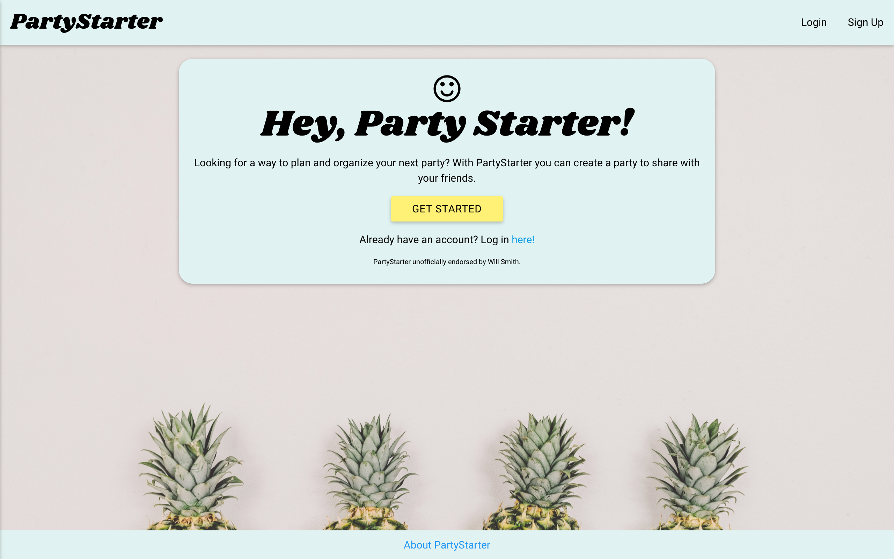
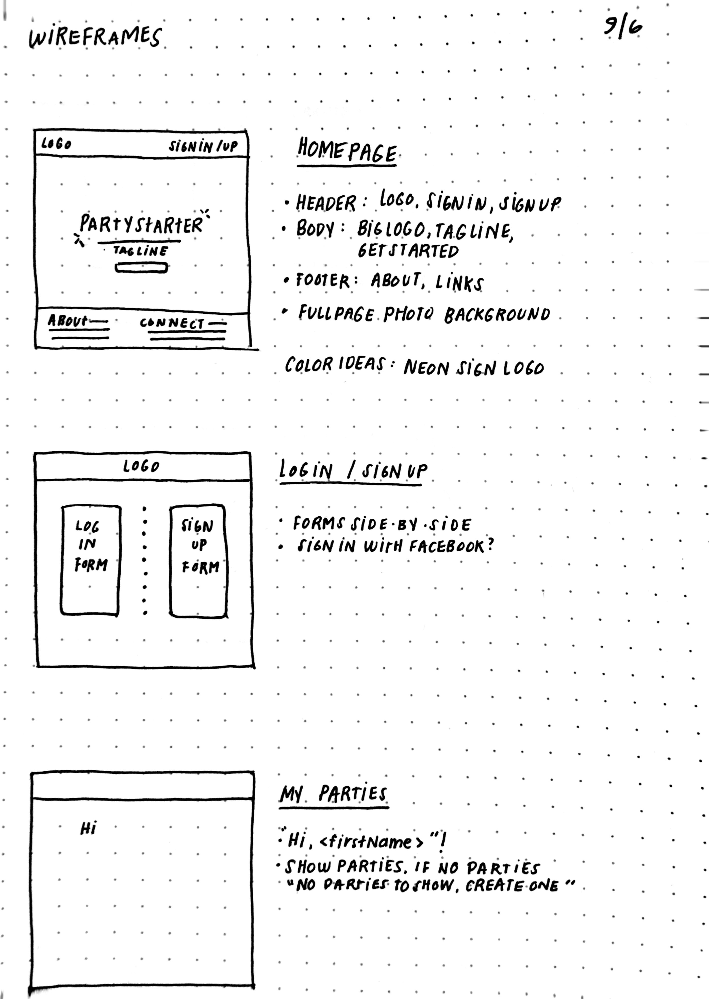
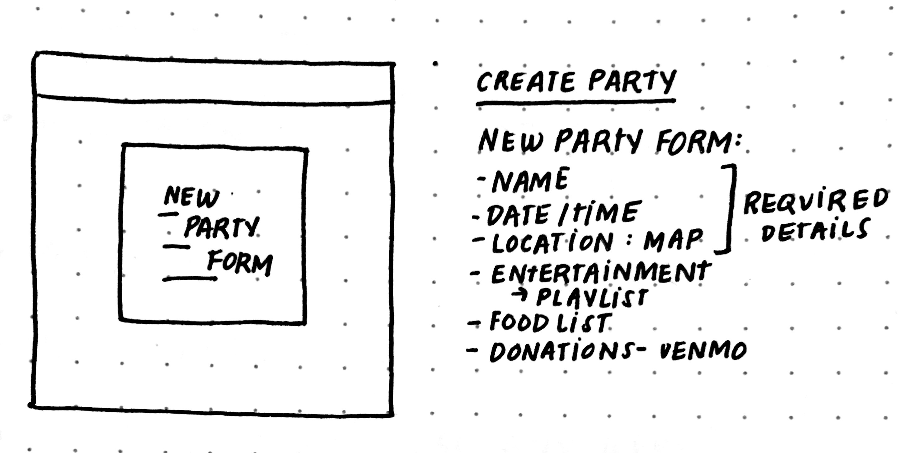

# WDI Project 3 - PartyStarter

**Project Link:** [party-starter.herokuapp.com](http://party-starter.herokuapp.com/#/home)  
**User Stories:** [Trello](https://trello.com/b/nwLwFUKM/wdi-project-3)  
**Daily Goals:** [Trello](https://trello.com/b/xONSzT9y/week-goals)

## Finished Product:



## Overview

This is group 5's product for the third project in General Assembly's Web Development Immersive.  We had to create a web app using the MEAN stack and at least two models created with Mongoose.  We chose to create an application to help users organize parties. This involved two mongoose models (user and party).

## Technologies Used

* **Languages:** HTML5, CSS3, JavaScript
* **MEAN Stack:** MongoDB, ExpressJS, AngularJS, and NodeJS
* **UI Framework:** MaterializeCSS
* **Icons and Fonts:** Google Fonts and fontawesome.io
* **ODM:** Mongoose
* **Security:** PassportJS, bcrypt-nodejs
* **Mockups:** Pen and Paper
* **Project Planning & User Stories:** Trello
* **Text Editors:** Atom and Sublime Text 3
* **Other:** uiRouter, momentjs

## Features

* Users can sign up, create parties, and see other created parties.
* Users can edit and delete their parties.
* Users can use the Google Maps API geocoding functionality to set their party's address. This stores the location's latitude, longitude, and formatted address.
* Users can see all parties created on a main parties page, and can get a glimpse of that party's details with small icons displayed.
* Users can view a party's details, including the time, the location on a Google map, and a description.

## Build Process

### Mockups

We drew basic sketches of some of our views, but actually did most of our 'mockups' by creating static html pages in a mock-layout branch of our project. This gave us more control of creating our layouts and designs, and gave us actual code that we could take and implement in our project's final views and templates.


##### PartyStarter Mockup




---

### Production Issues:
* One issue was with the datepicker we tried to use originally. It took dates correctly when they were selected, but the datepicker itself stretched and didn't give all dates as choices.  The solution to this was to find another datepicker module, which we found [here](https://github.com/720kb/angular-datepicker).
* We had some issues with dates during our project. We set up our party model in mongoose to take a mongoose date type  from our date picker. This took the date and stored it, but technically stored it as a string. The issue came on the edit page, when we tried to pre-fill the date picker with the date from the database. Because it was technically a string and not a JavaScript Date, it threw an error. The solution was to convert the stored date (which was technically a string) as a new JavaScript Date object. The date picker then took the Date object and pre-filled appropriately.
```javascript
this.storedDate = new Date(this.storedDate);
```

* In order to display the stored date string correctly on the party show page, we used momentjs, which was incredibly simple and effective. Unlike the date picker, momentjs was able to use the unconverted string in the party object and format it how we wanted it displayed on the party show page.
```javascript
this.date = moment(this.date).format('MM-DD-YYYY');
```

* One thing that slowed down progress was knowing what technologies and tools we wanted to use, but not having prior experience implementing them. The best example may have been with Google Maps and geocoding. This was a great tool, but it took us time and experimentation to figure out how to do it correctly.

---

## Future Development

There are many things we would love to change, modify, or add to this project.

#### Tweaks of current features
* One of our priorities would be to fix authorization in our application. In trying to implement features that require authorization, we discovered some issues with the user id being sent back being correct.
* In the future, we would like to use authorization to only display the 'edit' and 'delete' buttons for parties if the user is that party's organizer.  We currently don't have a 'delete' button at all.

#### Features for future implementation
* Add a map on the right side of the party list page showing all parties in the list.
* Implement sorting of parties on the list page. Users could see only parties they have organized, parties they are attending, or parties based on distance from their home.  Parties could be filtered by category or detail as well.  Ideally the markers of the map on the side would change dynamically.
* Implement the ability of a user to say they are attending a party. This would add them to the party's list of guests, and add the party to the user's list of parties.
* Add a food list option to party creation. Organizers could add food to the list that they want at their party so that guests know what to expect.
* Once food lists are implemented, create functionality to allow party attendees to 'claim' food off of the lists, saying they will bring it to the party.  This allows for more collaboration in hosting a party.
* Use the Spotify API to implement a playlist for the party. The organizer could create a playlist for the party, and could allow other Spotify users and party attendees to collaborate on the playlist.

---

##### Team 5:

|                   |                               Email                               |                          GitHub                         |
|:-----------------:|:-----------------------------------------------------------------:|:-------------------------------------------------------:|
|    Justin Doak    | [justin@jhdoak.com](mailto:justin@jhdoak.com)                     | [jhdoak](https://github.com/jhdoak)                     |
| Kirsten Humphreys | [kirstenrhumphreys@gmail.com](mailto:kirstenrhumphreys@gmail.com) | [kirstenhumphreys](https://github.com/kirstenhumphreys) |
|    Sam Mershon    | [samrmershon@gmail.com](mailto:samrmershon@gmail.com)             | [sammershon](https://github.com/sammershon)             |